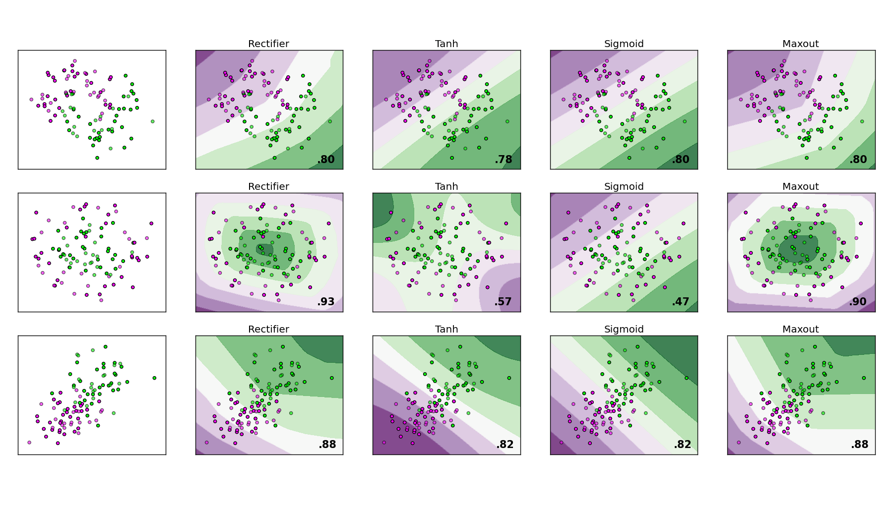
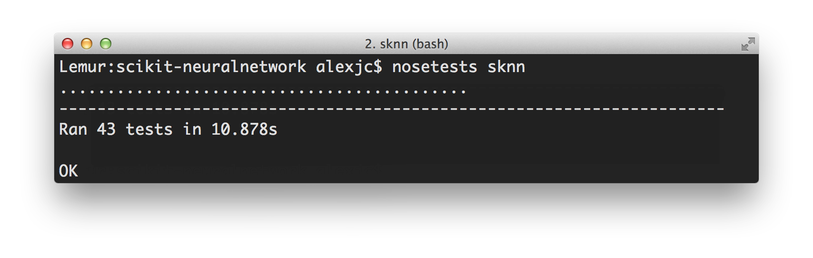

scikit-neuralnetwork
====================

Deep neural network implementation without the learning cliff!  This library implements multi-layer perceptrons, auto-encoders and (soon) recurrent neural networks with a stable Future Proof™ interface that's compatible with ``scikit-learn`` for a more user-friendly and Pythonic interface. It's a wrapper for powerful existing libraries such as ``lasagne`` currently, with plans for ``blocks``.

**NOTE**: This project is possible thanks to the `nucl.ai Conference <http://nucl.ai/>`_ on **July 18-20**. Join us in **Vienna**!

|Build Status| |Documentation Status| |Code Coverage| |License Type| |Project Stars| |Python Version|

----

Features
--------

By importing the ``sknn`` package provided by this library, you can easily train deep neural networks as regressors (to estimate continuous outputs from inputs) and classifiers (to predict discrete labels from features).

Thanks to the underlying ``Lasagne`` implementation, the code supports the following neural network features — exposed in an intuitive and `well documented <http://scikit-neuralnetwork.readthedocs.org/>`_ API:

* **Activation Functions —** ``Sigmoid``, ``Tanh``, ``Rectifier``, ``Softmax``, ``Linear``.
* **Layer Types —** ``Convolution`` (greyscale and color, 2D), ``Dense`` (standard, 1D).
* **Learning Rules —** ``sgd``, ``momentum``, ``nesterov``, ``adadelta``, ``adagrad``, ``rmsprop``, ``adam``.
* **Regularization —** ``L1``, ``L2``, ``dropout``, and batch normalization.
* **Dataset Formats —** ``numpy.ndarray``, ``scipy.sparse``, ``pandas.DataFrame`` and iterators (via ``callback``).

If a feature you need is missing, consider opening a `GitHub Issue <https://github.com/aigamedev/scikit-neuralnetwork/issues>`_ with a detailed explanation about the use case and we'll see what we can do.

Installation & Testing
----------------------

A) Download Latest Release [Recommended]
~~~~~~~~~~~~~~~~~~~~~~~~~~~~~~~~~~~~~~~~

If you want to use the latest official release, you can do so from PYPI directly::

    > pip install scikit-neuralnetwork

This will install the latest official ``Lasagne`` and ``Theano`` as well as other minor packages too as a dependency.  We strongly suggest you use a `virtualenv <https://virtualenv.pypa.io/en/latest/>`_ for Python.

B) Pulling Repositories [Optional]
~~~~~~~~~~~~~~~~~~~~~~~~~~~~~~~~~~

If you want to use the more advanced features like convolution, pooling or upscaling, these depend on the latest code from ``Lasagne`` and ``Theano`` master branches.  You can install them manually as follows::

    > pip install -r https://raw.githubusercontent.com/aigamedev/scikit-neuralnetwork/master/requirements.txt

Once that's done, you can grab this repository and install from ``setup.py`` in the exact same way::

    > git clone https://github.com/aigamedev/scikit-neuralnetwork.git
    > cd scikit-neuralnetwork; python setup.py develop
    
This will make the ``sknn`` package globally available within Python as a reference to the current directory.

Running Automated Tests
~~~~~~~~~~~~~~~~~~~~~~~

Then, you can run the samples and benchmarks available in the ``examples/`` folder, or launch the tests to check everything is working::

    > pip install nose
    > nosetests -v sknn.tests

We strive to maintain 100% test coverage for all code-paths, to ensure that rapid changes in the underlying backend libraries are caught automatically.

Getting Started
---------------

The library supports both regressors (to estimate continuous outputs from inputs) and classifiers (to predict discrete labels from features).  This is the ``sklearn``-compatible API:

.. code:: python

    from sknn.mlp import Classifier, Layer

    nn = Classifier(
        layers=[
            Layer("Rectifier", units=100),
            Layer("Softmax")],
        learning_rate=0.02,
        n_iter=10)
    nn.fit(X_train, y_train)

    y_valid = nn.predict(X_valid)

    score = nn.score(X_test, y_test)

The `generated documentation <http://scikit-neuralnetwork.readthedocs.org/>`_ as a standalone page where you can find more information about parameters, as well as examples in the `User Guide <http://scikit-neuralnetwork.readthedocs.org/en/latest/#user-guide>`_.

Demonstration
-------------

To run the example that generates the visualization above using our ``sknn.mlp.Classifier``, just run the following command in the project's root folder::

    > python examples/plot_mlp.py --params activation

There are multiple parameters you can plot as well, for example ``iterations``, ``rules`` or ``units``.  The datasets are randomized each time, but the output should be an image that looks like this...

Links & References
------------------

* `Lasagne <https://github.com/Lasagne/Lasagne>`_ by benanne — The amazing neural network library that powers ``sknn``.
* `Theano <https://github.com/Theano/Theano>`_ by LISA Lab — Underlying array/math library for efficient computation.
* `scikit-learn <http://scikit-learn.org/>`_ by INRIA — Machine learning library with an elegant Pythonic interface.

----

|Build Status| |Documentation Status| |Code Coverage| |License Type| |Project Stars| |Python Version|

.. |Build Status| image:: https://travis-ci.org/aigamedev/scikit-neuralnetwork.svg?branch=master
   :target: https://travis-ci.org/aigamedev/scikit-neuralnetwork

.. |Documentation Status| image:: https://readthedocs.org/projects/scikit-neuralnetwork/badge/?version=latest
    :target: http://scikit-neuralnetwork.readthedocs.org/

.. |Code Coverage| image:: https://coveralls.io/repos/aigamedev/scikit-neuralnetwork/badge.svg?branch=master
    :target: https://coveralls.io/r/aigamedev/scikit-neuralnetwork?branch=master

.. |License Type| image:: https://img.shields.io/badge/license-New%20BSD-blue.svg
    :target: https://github.com/aigamedev/scikit-neuralnetwork/blob/master/LICENSE

.. |Project Stars| image:: https://img.shields.io/github/stars/aigamedev/scikit-neuralnetwork.svg
    :target: https://github.com/aigamedev/scikit-neuralnetwork/stargazers    

.. |Python Version| image:: http://aigamedev.github.io/scikit-neuralnetwork/badge_python.svg
    :target: https://www.python.org/
